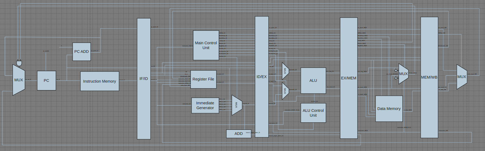

# 5-Stage Pipelined RISC-V Core

This project is a 5-stage pipelined RISC-V processor core implemented in Verilog HDL. It consists of five stages: Instruction Fetch (IF), Instruction Decode (ID), Execute (EX), Memory Access (MEM), and Write Back (WB).

[ RISC-V Ver.2 ] structural improvement
https://github.com/CourageHW/risc-v
## 🚀 Key Features

-   **5-Stage Pipeline**: IF, ID, EX, MEM, WB
-   **RISC-V ISA**: Supports a subset of the RV32I base instruction set.
-   **Data Forwarding**: Supported by forwarding_unit.
-   **Hazard Handling**: Not yet implemented (to be added in the future).
-   **Vivado Simulation**: Supported via the `run_vivado.sh` script.

## 📂 Directory Structure

```
/home/yonggi/Project_verilog/risc-v/
├───.gitignore
├───img/
│   └───blueprint.png
└───riscv_pipeline/
    ├───run_vivado.sh              # Vivado simulation execution script
    ├───simulate.tcl               # Vivado Tcl script
    ├───src/                       # Source code
    │   ├───program.mem            # Program memory initial values
    │   ├───riscv_pipeline_core.sv # Top-level module
    │   ├───1.fetch/               # Fetch Stage modules
    │   ├───2.decode/              # Decode Stage modules
    │   ├───3.execute/             # Execute Stage modules
    │   ├───4.memory/              # Memory Stage modules
    │   ├───5.writeback/           # Write Back Stage modules
    │   ├───6.hazard_processing    # hazard_processing modules
    │   └───header/
    │       └───defines.sv         # Global definitions
    └───testbench/
        └───tb_riscv_pipeline_core.sv # Testbench
```

## ⚙️ Getting Started

### Simulation

To simulate the project, execute the following command in the `riscv_pipeline` directory.

If you want gui (waveform)
```bash
./run_vivado.sh -gui
```

If you want just result (no waveform)
```bash
./run_vivado.sh
```

This script runs Vivado in batch mode and performs the simulation according to the procedures defined in the `simulate.tcl` file.

## 🛠️ Tech Stack

-   **Language**: Verilog HDL (SystemVerilog)
-   **Simulation Tool**: Xilinx Vivado

## 🖼️ Architecture

